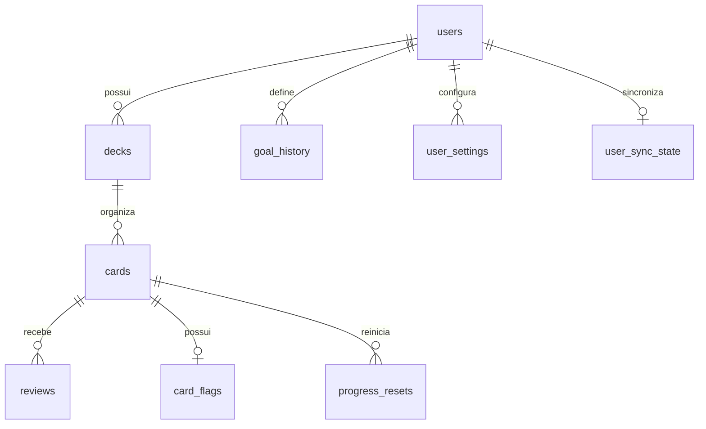
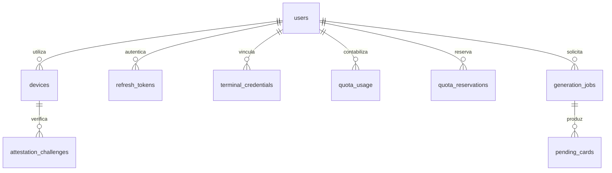

# Modelo de dados e persistência

O modelo central é definido pelos modelos SQLAlchemy em `backend/app/models.py` e pelas migrações em `backend/alembic/`. O banco de desenvolvimento em `compose.yaml` usa PostgreSQL 16. Identificadores de entidades sincronizadas são criados pelo cliente e representados como texto de até 36 caracteres no servidor; a posse é sempre checada pelo `user_id` autenticado. IDs não são autorização.

## Núcleo relacional

O diagrama expressa relações de domínio, não uma lista de todas as constraints SQL. `decks.user_id`, `cards.user_id`, `reviews.user_id`, `card_flags.user_id`, `progress_resets.user_id`, `goal_history.user_id`, `user_settings.user_id` e `user_sync_state.user_id` possuem FK física para `users`. As referências `cards.deck_id`, `reviews.card_id`, `card_flags.card_id`, `progress_resets.card_id` e a hierarquia `decks.parent_id` são lógicas: mudanças offline podem chegar fora de ordem, e o serviço de sync valida propriedade e convergência. Consultar a migração antes de acrescentar uma constraint cruzada que impeça essa ordenação.

| Entidade | Chave e papel |
| --- | --- |
| `users` | Conta, que pode existir antes do cadastro por e-mail. |
| `user_sync_state` | Cursor sequencial por usuário, usado para atribuir `server_seq` em ordem de commit. |
| `decks`, `cards` | Biblioteca mutável com `updated_at`, `deleted_at`, `device_id` e `server_seq`. O conteúdo do cartão é frente, verso e etiquetas; tipos objetivos ainda não persistem todos os atributos na base central. |
| `card_flags` | Estado operacional do cartão separado do texto, para reduzir conflitos entre suspensão/adiamento e edição. |
| `reviews` | Eventos imutáveis com ID, momento, nota, origem, dispositivo e campos consultivos do scheduler; atualização/exclusão é impedida por trigger. |
| `progress_resets`, `goal_history` | Histórico de reinício e mudanças de meta, sem destruir eventos anteriores. |
| `user_settings` | Configurações sincronizadas que interferem no cálculo, como retenção desejada e parâmetros do FSRS. |

## Conta, terminal e geração

`terminal_credentials.device_id` é a chave do terminal físico e não uma FK para `devices.id`, que representa instalações de aplicativo. `terminal_credentials.deck_ids` e `reported_deck_ids` separam o estado desejado do observado. `pending_cards.job_id` possui FK física para `generation_jobs`; `generation_jobs.quota_reservation_id` e `target_deck_id` são referências lógicas. `attestation_challenges.device_id` é um identificador associado à instalação, sem FK declarada no modelo. As tabelas `devices`, `refresh_tokens`, `terminal_credentials`, `quota_usage`, `quota_reservations`, `generation_jobs` e `pending_cards` incluem vínculo físico ou lógico com a conta conforme `models.py`.

O worker consome `generation_jobs` com bloqueio de linhas e cria `pending_cards`, que aguardam aprovação. A cota usa `quota_usage` e `quota_reservations`; reservas expiradas podem ser liberadas. Tokens de renovação e de terminal ficam representados por hashes no servidor. A política de exclusão da conta preserva somente o fato mínimo necessário para evitar reutilização da concessão gratuita em uma instalação, conforme `Device.free_grant_spent`.

## Consistência entre camadas

O móvel mantém uma cópia SQLite das entidades sincronizadas, estado derivado do scheduler, outbox e cursores. A web não mantém banco local de estudo: seu `Store` é um espelho em memória. O terminal usa microSD como fonte de definições quando disponível, com fallback local, LittleFS para estados, histórico append-only, outbox e cursores e NVS para perfis/credencial de rede. O servidor não sincroniza `card_states` como fato independente: o replay das revisões, resets e configurações alimenta o próximo vencimento. Exclusões de conteúdo usam tombstones para propagar a remoção.

A lacuna de representação de tipos objetivos nos produtores de snapshot e a incompatibilidade de revisão no caminho direto estão descritas em [../integration/t5-touch.md](../integration/t5-touch.md). Não apresentar o DER conceitual como prova de que essas informações já trafegam ponta a ponta.
