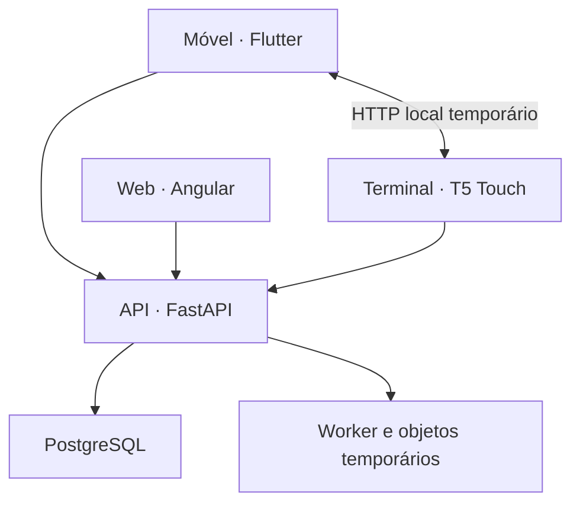

# Visão de arquitetura

Mnemos possui três clientes de estudo: Flutter no móvel, Angular na web e firmware dedicado no T5 Touch. Móvel e web são superfícies completas de revisão; o terminal acrescenta uma sessão física de baixa distração. A conta, a biblioteca e o histórico compartilhado pertencem à plataforma. O backend oferece autenticação, sincronização e geração assistida, apoiado por PostgreSQL, worker e armazenamento temporário de arquivos.

A comunicação local móvel–terminal usa Device Protocol v4 por SoftAP ou LAN e token efêmero. A comunicação remota usa a API de conta para móvel/web e uma credencial restrita ao terminal. O servidor mantém a seleção desejada de baralhos separada do estado físico reportado. Conteúdo é criado nas aplicações e distribuído ao terminal; revisões feitas no terminal devem voltar ao histórico comum. Na ramificação atual, essa última etapa direta está bloqueada pela divergência de payload descrita em [../integration/t5-touch.md](../integration/t5-touch.md).

O móvel usa Drift/SQLite para persistência local e outbox; a web mantém o espelho em memória e depende de recarga pelo servidor após reinício da página. O terminal guarda definições de cartões no microSD quando disponível e estados, histórico, sessão e outbox no LittleFS. Cada cliente calcula o estado de agendamento a partir das revisões e configurações relevantes; o banco central armazena o histórico, não um `card_state` autoritativo sincronizado.

O diretório `spec/` publica interfaces versionadas para interoperabilidade; `shared/contract.yaml` gera constantes e enums específicos das implementações oficiais. Nem o banco Drift, nem tabelas SQL, nem classes C++ constituem por si um protocolo público. As implementações de backend podem variar, mas precisam preservar autenticação, escopo, idempotência e semântica dos contratos adotados. Veja [data-model.md](data-model.md) e [../developers/third-party-integration.md](../developers/third-party-integration.md).
