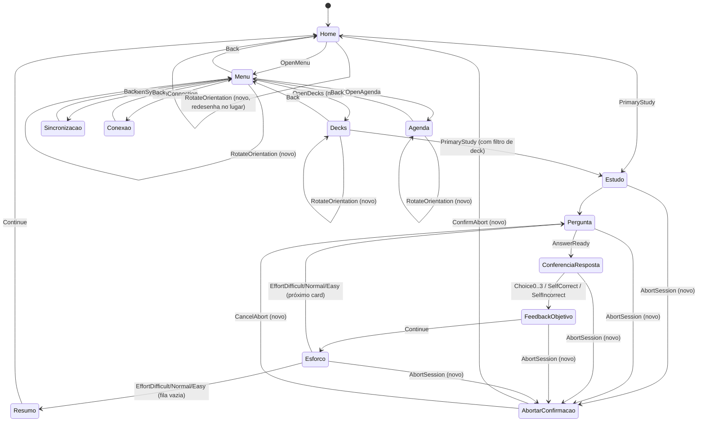

# Diretrizes de HMI — Mnemos Terminal T5-Touch (ED047TC1)

**Status:** proposta técnica para implementação
**Escopo:** `firmware/t5/` — variante com touchscreen capacitivo, ainda não implementada
**Não substitui:** `docs/ux/HMI_PRINCIPLES_v0.4.md`, `docs/ux/SCREEN_MAP_v0.4.md`, `docs/developers/FIRMWARE_ARCHITECTURE_v0.5.md` — este documento os **estende** para o caso de entrada por toque, mantendo os mesmos contratos de dados, o mesmo `StudyEngine` e o mesmo `UiAction` como camada de desacoplamento entre hardware e lógica.

---

## 0. Enquadramento do problema

O firmware atual (`firmware/t5/`, v0.6.0-preview.2) já é um cliente completo da plataforma, mas assume **CardKB** como único dispositivo de entrada (`TOUCH_ENABLED = false` em `include/config.h`). O mesmo arquivo já reserva a infraestrutura elétrica para o touch:

```cpp
// firmware/t5/include/config.h
constexpr int SYSTEM_I2C_SDA = 18;      // compartilhado com o RTC PCF8563
constexpr int SYSTEM_I2C_SCL = 17;
constexpr int FUTURE_TOUCH_IRQ = 47;
constexpr bool TOUCH_ENABLED = false;
```

O comentário original identifica o controlador alvo como **GT911** (capacitivo, I2C). Este documento assume GT911 como controlador de referência. Se o hardware final usar outro chip (ex.: FT6336), apenas a camada de driver de baixo nível muda — o mapeamento de zonas de toque e o restante do documento permanecem válidos, pois tudo é expresso em coordenadas lógicas de tela, não em registradores do controlador.

O princípio arquitetural que torna este documento possível já está escrito em `docs/developers/FIRMWARE_ARCHITECTURE_v0.5.md` e no `README.md` do T5:

> "A entrada é convertida para `UiAction`, mantendo separação entre dispositivo físico e lógica de aplicação. [...] uma futura versão com touchscreen poderá produzir as mesmas ações sem alterar o `StudyEngine`."

Ou seja: **este documento não propõe uma nova HMI paralela**, e sim um segundo produtor de `UiAction` (toque, em vez de teclas do CardKB) mais uma extensão das rotinas de desenho de `T5Display` para operar em modo touch-first. `StudyEngine`, `LearningModel`, `ScheduleService` e o restante do pipeline pedagógico permanecem intocados.

### 0.1 Divergência deliberada em relação ao Screen Map v0.4

`docs/ux/SCREEN_MAP_v0.4.md` define a Home do terminal como: *"due summary, Start Session, Synchronization, Connection"* — sem navegação por deck, porque a filosofia de produto (`HMI_PRINCIPLES_v0.4.md`) atribui autoria e organização de biblioteca ao app móvel, não ao terminal.

Este documento propõe uma tela **Decks** no terminal, a pedido explícito do escopo do projeto. Para não violar o princípio de produto, ela é definida com responsabilidade estrita:

> **Decks** responde apenas: *"dentre o conteúdo já sincronizado neste terminal, qual subconjunto eu quero estudar agora?"*

Ela é uma tela de **composição de sessão** (equivalente a um filtro do `StudyEngine`), não uma tela de gerência de biblioteca. Não há criar, renomear, arquivar, excluir ou editar deck — essas ações continuam exclusivas do app móvel, conforme `HMI_PRINCIPLES_v0.4.md`. Isso deve ficar explícito em qualquer especificação derivada deste documento, para evitar que a tela evolua silenciosamente para uma superfície de autoria.

---

## 1. Hardware: o que realmente restringe o design

### 1.1 Painel

| Parâmetro | Valor |
|---|---|
| Painel | ED047TC1 (LILYGO T5-4.7, driver `LilyGo-EPD47`/epdiy) |
| Resolução nativa do controlador | 960 × 540 px (paisagem, conforme `EPD_WIDTH`/`EPD_HEIGHT` já usados em `t5_display.cpp`) |
| Área útil declarada para este projeto | 540 (H) × 960 (V) — **retrato** |
| Profundidade de cor | 4 bpp — 16 níveis de cinza (0x00–0xFF, passo 0x11) |
| Framebuffer atual | `EPD_WIDTH * EPD_HEIGHT / 2` bytes (2 px/byte, já implementado em `T5Display::begin()`) |
| Tecnologia | e-paper (biestável, sem backlight, sem taxa de quadro contínua) |

**Implicação de orientação:** o driver nativo entrega o framebuffer em paisagem (960×540). Como o produto define retrato (540×960) como orientação primária, a camada de desenho precisa de uma **transformação de coordenadas 90°** entre o espaço lógico de UI (retrato) e o espaço físico do framebuffer (paisagem), ou equivalente suportado pela biblioteca `LilyGo-EPD47`. Isso deve ser resolvido em uma única função de mapeamento (`toPanelSpace(x, y)`), nunca espalhado pelas rotinas de desenho — ver §9.4.

### 1.2 Por que 16 tons de cinza mudam as regras de UI

Diferente de um display colorido (caso do CYD, TFT ILI9341 com touch resistivo XPT2046, já implementado em `firmware/cyd/`), aqui:

- **Não existe codificação por matiz.** Toda distinção semântica (certo/errado, selecionado/não selecionado, ativo/inativo) precisa sobreviver à conversão para luminância. Cor não pode ser o único canal.
- **Meios-tons "ghosteiam".** Pixels em cinza médio que trocam de estado com frequência deixam resíduo visual entre atualizações parciais. Zonas de alto contraste (preto puro / branco puro) são preferíveis para elementos que mudam de estado (botões pressionados, seleção de alternativa).
- **Não há taxa de quadro.** Toda mudança visual é um "custo" de atualização física do painel (ver §6). Uma UI de toque bem-sucedida aqui é uma UI que **minimiza o número de redraws**, não uma que anima transições.

### 1.3 Controlador de toque (GT911, I2C)

- Barramento compartilhado com o RTC PCF8563 (`SYSTEM_I2C_SDA=18`, `SYSTEM_I2C_SCL=17`) — leituras de toque e leituras do RTC competem pelo mesmo barramento; a rotina de polling de toque não pode bloquear a leitura periódica do relógio nem vice-versa. Recomenda-se um mutex leve ou uma janela de tempo dedicada, análoga ao que já existe para o CardKB (`CARDKB_POLL_MS`).
- IRQ dedicado (`FUTURE_TOUCH_IRQ = 47`): o GT911 deve operar por interrupção, não por polling contínuo, para permitir *deep sleep* entre interações — coerente com o uso de bateria já monitorado por `battery_service.h`.
- GT911 é capacitivo multitoque, mas **este documento define a HMI como single-touch**. Multitoque não tem valor pedagógico aqui e apenas aumenta a superfície de bugs de gesto.

### 1.4 Densidade de pixel e dimensionamento de alvos de toque

Cálculo a partir da diagonal física de 4,7":

```
diagonal_px = sqrt(540² + 960²) = sqrt(1.213.200) ≈ 1101,45 px
PPI         = 1101,45 / 4,7      ≈ 234,3 ppi
px/mm       = 234,3 / 25,4       ≈ 9,22 px/mm
```

234 ppi é uma densidade alta (comparável a smartphones de gama média), o que **não** significa que os alvos de toque podem ser pequenos — significa o oposto: cada milímetro físico custa ~9,2 px, então é fácil sub-dimensionar um botão sem perceber olhando só para o número em pixels.

| Alvo de toque | Tamanho físico recomendado | Em pixels (@9,22 px/mm) |
|---|---|---|
| Mínimo absoluto (ex.: item secundário de lista) | 9 mm | ≈ 83 px |
| Padrão (ex.: alternativa de múltipla escolha) | 11 mm | ≈ 101 px |
| Ação primária (ex.: "Avaliar", "Continuar") | 13 mm | ≈ 120 px |
| Ação crítica isolada (ex.: **Abortar**) | 14 mm, com espaçamento extra | ≈ 129 px |
| Espaçamento mínimo entre alvos adjacentes | 2,5 mm | ≈ 23 px |

**Por que maior que o padrão de smartphone (~7–9 mm):** em e-paper touch não há retorno visual instantâneo (ver §1.2 e §6). O usuário não vê o botão "acender" no instante do toque; ele só vê o efeito quando o redraw acontece, com latência perceptível. Alvos maiores e mais espaçados reduzem a taxa de toques acidentais que só serão percebidos como erro centenas de milissegundos depois, quando já é tarde para corrigir sem uma tela extra.

---

## 2. Princípios de HMI aplicados ao touch e-paper

Estes princípios estendem — sem contradizer — `docs/ux/HMI_PRINCIPLES_v0.4.md`.

1. **Uma tela, uma decisão.** Cada tela de estudo apresenta no máximo uma decisão principal (responder, avaliar, confirmar esforço). Ações secundárias (menu, abortar, girar) ficam visualmente subordinadas, nunca competindo em tamanho com a ação primária.
2. **Toque tem custo de redesenho; leitura não tem custo.** Prefira mostrar mais texto/contexto em uma tela estática a dividir em múltiplas telas que forçam mais toques. Isso é o oposto do que se otimizaria em um app móvel com scroll suave.
3. **Feedback de toque é obrigatório e é *rápido*, mesmo que o conteúdo final seja lento.** Todo toque válido deve produzir uma indicação imediata e barata (ver §6.2 — atualização parcial monocromática do próprio alvo) antes do redraw completo da tela seguinte. Um toque sem qualquer resposta em <150 ms é indistinguível, para o usuário, de um toque perdido.
4. **Sem gestos ambíguos.** Nada de swipe, pinch ou long-press como mecanismo primário. E-paper não tem como acompanhar visualmente um gesto contínuo. Toda interação é *tap* discreto sobre um alvo com limites bem definidos e visíveis.
5. **Estado do botão é geometria e peso, não cor.** "Selecionado" é comunicado por preenchimento sólido invertido (fundo preto, texto branco) ou moldura dupla — nunca por matiz.
6. **A resposta de referência nunca aparece antes da tentativa do usuário** (princípio já existente no README do T5) — reafirmado aqui porque telas touch tendem a tentar mostrar "tudo de uma vez"; isso é uma tentação a resistir explicitamente no layout de Pergunta.
7. **Orientação e Abortar são periféricos e persistentes, nunca centrais.** Vivem sempre no mesmo canto físico, em todas as telas onde fazem sentido, com o mesmo tamanho e alcance de toque, para virarem "reflexo motor" do usuário e não exigirem procura visual.

---

## 3. Sistema de grid e layout

O código atual já define uma malha para retrato-lógico de 540×960, reaproveitada e estendida aqui (constantes reais de `t5_display.cpp`):

```cpp
constexpr int32_t MARGIN_X  = 48;   // já usado hoje
constexpr int32_t HEADER_Y  = 30;   // baseline do texto de cabeçalho
constexpr int32_t CONTENT_Y = 104;  // início da área de conteúdo
constexpr int32_t FOOTER_Y  = 512;  // baseline do rodapé (tela CardKB, 540 de altura)
```

Esses valores foram calibrados para uma tela de **540 px de altura** (o modo atual do CardKB roda em paisagem 960×540, ver §1.1). Para a variante touch, a orientação primária é retrato (540×960) — a grade precisa ser redefinida em função da altura de 960, mantendo a mesma lógica de proporção.

### 3.1 Grade — Retrato (540 × 960), orientação primária

```
┌──────────────────────────────────────┐  y=0
│ [≡ Menu]      MNEMOS        [⟲][⨯]   │  Barra de sistema — 0..88 px
├──────────────────────────────────────┤  y=88
│                                       │
│                                       │
│                                       │
│           ÁREA DE CONTEÚDO           │  88..824 px (736 px úteis)
│         (pergunta / lista /          │
│          agenda / decks)             │
│                                       │
│                                       │
├──────────────────────────────────────┤  y=824
│         ÁREA DE AÇÃO PRIMÁRIA        │  824..960 px (136 px)
└──────────────────────────────────────┘  y=960

Margens laterais: 48 px (herdadas do layout atual)
Largura útil de conteúdo: 540 - 2*48 = 444 px
```

- **Barra de sistema (88 px de altura):** fixa em todas as telas exceto Boot e QR de provisionamento. Contém, da esquerda para a direita: botão Menu (☰, alvo 88×88 px), assinatura `MNEMOS` centralizada (identidade constante, conforme README), e à direita dois botões de sistema fixos: **Girar** (⟲) e **Abortar** (⨯) — este último **só visível durante sessão de estudo ativa** (ver §8).
- **Área de conteúdo (736 px):** região que cada tela especializa.
- **Área de ação primária (136 px):** reservada ao(s) botão(ões) de maior hierarquia da tela atual (ex.: "Avaliar", "Continuar", "Estudar agora"). Separada da área de conteúdo por um filete de 1 px em `MID_GRAY` para reforçar a fronteira sem depender de espaço em branco apenas.

### 3.2 Grade — Paisagem (960 × 540), após girar tela

```
┌───────────────────────────────────────────────────────────────┐ y=0
│ [≡]        MNEMOS                              [⟲][⨯]         │ 0..72
├───────────────────────────────┬───────────────────────────────┤ y=72
│                                │                               │
│      ÁREA DE CONTEÚDO A       │      ÁREA DE CONTEÚDO B        │ 72..468
│   (pergunta / texto principal) │  (alternativas / ação /       │
│                                │   metadados secundários)       │
│                                │                               │
├───────────────────────────────┴───────────────────────────────┤ y=468
│                    ÁREA DE AÇÃO PRIMÁRIA                       │ 468..540
└───────────────────────────────────────────────────────────────┘ y=540

Margens laterais: 48 px | Coluna central de respiro: 24 px
```

Em paisagem, a altura útil cai para 540 px — quase 45% menos altura que o retrato. Por isso a paisagem **não** é um simples "mesmo layout deitado": ela usa duas colunas para não sacrificar tamanho de fonte. A regra de produto é:

> **Retrato é a orientação de estudo recomendada.** Paisagem é suportada para acessibilidade/preferência (ex.: apoio de mesa fixo, usuários que preferem texto mais largo por linha), mas o conteúdo por card em paisagem tem um orçamento de caracteres ~30% menor (ver §7) para não forçar fonte reduzida.

### 3.3 Zonas seguras

- Nenhum alvo de toque interativo a menos de 12 px da borda física do painel (folga para moldura/case).
- Os botões de sistema (Menu, Girar, Abortar) ocupam sempre o mesmo canto absoluto **na orientação atual**, e trocam de posição apenas quando a orientação muda — nunca por navegação entre telas dentro da mesma orientação. Isso constrói memória motora.

---

## 4. Escala de cinza e paleta

### 4.1 Os 16 níveis (4 bpp)

O framebuffer usa 1 byte a cada 2 pixels, ou seja, 4 bits por pixel = 16 níveis possíveis de `0x00` (preto) a `0xFF` (branco) em passos de `0x11` (17 decimal). O código atual (`t5_display.cpp`) já define 5 desses 16 níveis como constantes nomeadas:

```cpp
constexpr uint8_t BLACK      = 0x00;  // nível 0
constexpr uint8_t DARK_GRAY  = 0x55;  // nível 5
constexpr uint8_t MID_GRAY   = 0x99;  // nível 9
constexpr uint8_t LIGHT_GRAY = 0xDD;  // nível 13
constexpr uint8_t WHITE      = 0xFF;  // nível 15
```

**Recomendação:** manter exatamente esses 5 tons como o "vocabulário" oficial de cinza da HMI (em vez de usar os 16 níveis livremente). Um vocabulário restrito de 5 tons, aplicado com consistência semântica, garante legibilidade e evita banding perceptível em conteúdo estático. Os 16 níveis completos ficam reservados para dithering em elementos gráficos (§10), nunca para texto ou UI chrome.

| Token | Valor | Nível (0–15) | Uso semântico fixo |
|---|---|---|---|
| `BLACK` | `0x00` | 0 | Texto principal, ícones ativos, moldura de foco, preenchimento de seleção |
| `DARK_GRAY` | `0x55` | 5 | Texto secundário, rótulos, contorno de elementos inativos |
| `MID_GRAY` | `0x99` | 9 | Divisores, filetes de separação de seção, placeholders |
| `LIGHT_GRAY` | `0xDD` | 13 | Fundo de cartão/painel elevado sobre o fundo branco |
| `WHITE` | `0xFF` | 15 | Fundo padrão da tela |

### 4.2 Mapeamento da paleta de marca (`HMI_PRINCIPLES_v0.4.md`) para este vocabulário

A paleta de marca foi definida para telas coloridas (app/web). Convertendo por luminância relativa (`0,299R + 0,587G + 0,114B`) para posicionar cada cor na régua de 16 níveis:

| Cor de marca | Hex | Luminância (0–255) | Nível de cinza equivalente | Token de e-paper recomendado |
|---|---|---:|---:|---|
| Marfim Calmo | `#F4F1E8` | 241 | 15 | `WHITE` |
| Cinza Névoa | `#D9D5CC` | 213 | 13 | `LIGHT_GRAY` |
| Latão Fosco | `#B8A27A` | 164 | 10 | entre `LIGHT_GRAY` e `MID_GRAY` |
| Sálvia Analógica | `#7A8B72` | 131 | 8 | `MID_GRAY` |
| Terracota Contida | `#B56E52` | 128 | 8 | `MID_GRAY` |
| Azul Petróleo | `#365462` | 77 | 5 | `DARK_GRAY` |
| Grafite Profundo | `#1F1F1F` | 31 | 2 | próximo de `BLACK` |

**Achado relevante para o design:** Sálvia Analógica e Terracota Contida — duas cores com papéis semânticos distintos na marca — colapsam para o **mesmo nível de cinza (8)**. Em telas coloridas isso não é problema; em e-paper 16 tons, **qualquer par de cores da marca usado para codificar estados diferentes (ex.: "correto" vs. "incorreto", ou "deck ativo" vs. "deck pausado") precisa de um segundo canal de diferenciação além do tom** — peso de traço, preenchimento sólido vs. hachurado, ou um ícone, nunca luminância isolada. Esta é a justificativa técnica direta para o Princípio 5 (§2).

### 4.3 Regra de contraste

- Texto de corpo: sempre `BLACK` sobre `WHITE` (contraste máximo, nível 0 vs. 15).
- Nunca posicionar texto sobre `MID_GRAY` (nível 9) — a diferença de luminância para `BLACK` (Δ9) é insuficiente para leitura confortável em e-paper reflexivo sob luz variável.
- Texto secundário/metadado pode ser `DARK_GRAY` sobre `WHITE` (Δ10, aceitável para texto pequeno de apoio, nunca para o conteúdo principal do card).

---

## 5. Tipografia

O corpo atual usa a fonte `Roboto12` (bitmap, ver `roboto12.h`) para todo o texto. Para a variante touch, recomenda-se uma hierarquia explícita de 3 a 4 tamanhos, evitando a tentação de introduzir muitas famílias/pesos (custo de flash e de nitidez em bitmap fonts):

| Papel | Tamanho aproximado | Peso | Exemplo de uso |
|---|---|---|---|
| Título de tela | 20–22 px | Regular, `BLACK` | "Agenda", "Sincronização" |
| Corpo — pergunta/resposta | 18–20 px, interlinha 1,4× | Regular, `BLACK` | Texto de `question`/`answer` do card |
| Rótulo de alternativa | 16–18 px | Regular, `BLACK` sobre fundo `LIGHT_GRAY` do card de alternativa | `multiple_choice`, `true_false` |
| Metadado / rodapé | 13–14 px | Regular, `DARK_GRAY` | Contagem "3 de 10", nome do deck, hora |

**Orçamento de caracteres por linha** (largura útil 444 px em retrato, fonte corpo ~18px): aproximadamente **34–38 caracteres por linha**, **6 linhas** visíveis na área de conteúdo do card (736 px de altura, descontando cabeçalho do tipo de card) antes de truncar. Isso já reflete o padrão existente em `t5_display.cpp` (`drawWrapped(..., maxLines, ...)` e `truncateText`), apenas recalibrado para a altura maior do retrato.

---

## 6. Estratégia de atualização de tela (refresh)

### 6.1 Situação atual do firmware

Hoje `T5Display` implementa **apenas full refresh**:

```cpp
void T5Display::refreshFull() {
    ensurePower();
    epd_clear();
    epd_draw_grayscale_image(epd_full_screen(), framebuffer_);
    ...
}
```

Isso é aceitável para CardKB, onde a cadência de interação é naturalmente mais lenta (usuário digita, decide, tecla). **Para touch, full refresh a cada toque produz uma experiência ruim**: o painel inteiro pisca (inversão preto/branco característica de e-paper) mesmo para trocar o estado de um único botão.

### 6.2 Proposta de três modos de atualização

| Modo | Quando usar | Custo percebido | Observação de implementação |
|---|---|---|---|
| **Full (16 tons)** | Troca de tela completa (Home → Menu, Pergunta → Feedback, mudança de orientação) | Alto (piscada completa, ~1–2 s típico para 4bpp neste tamanho de painel) | É o único modo já implementado hoje (`refreshFull`) |
| **Parcial monocromático** | Feedback imediato de toque (§2, Princípio 3): destacar o alvo tocado antes do conteúdo final estar pronto | Baixo (~100–300 ms, sem flash de tela inteira) | Requer avaliar na biblioteca `LilyGo-EPD47` a primitiva de atualização por região/monocromática (não confirmado neste repositório — ação de pesquisa técnica antes da implementação) |
| **Parcial em escala de cinza, região limitada** | Atualizar só a área de conteúdo quando a moldura (header/footer) não muda — ex.: avançar de card para card dentro da mesma tela de Pergunta | Médio | Mesma ressalva acima quanto à primitiva de biblioteca |

**Diretriz de produto, independente da primitiva final escolhida:**
1. Todo toque em um alvo visível dispara, no máximo em 150 ms, uma indicação local (inversão do próprio botão tocado) usando o modo mais barato disponível.
2. Full refresh é reservado para transições de tela, nunca para feedback de toque isolado.
3. Se a biblioteca de driver não suportar atualização parcial monocromática de forma confiável neste hardware, a alternativa aceitável é: reduzir o full refresh ao **retângulo do alvo tocado mais o retângulo de conteúdo afetado**, em vez do painel inteiro — ainda full refresh em qualidade, mas parcial em área.

### 6.3 Refresh ao girar a tela

Girar sempre implica full refresh de painel inteiro (a reorganização geométrica de todos os elementos não permite atualização parcial). O botão Girar deve, portanto, ser deliberadamente menos "barato" no fluxo do que os demais — ver §9.

---

## 7. Mapa de telas e navegação

Estende `docs/ux/SCREEN_MAP_v0.4.md` para a superfície touch. Ações herdadas do `UiAction` atual permanecem; novas ações estão marcadas com **(novo)**.



Notas sobre o diagrama:
- `AbortarConfirmacao` é alcançável de **qualquer** tela dentro de uma sessão de estudo ativa (Pergunta, ConferenciaResposta, FeedbackObjetivo, Esforço) — nunca da tela de Resumo, onde a sessão já terminou e "abortar" deixa de fazer sentido semântico.
- `RotateOrientation` é uma auto-transição: a tela lógica não muda, apenas seu layout físico. Isso é importante para o `StudyEngine`: girar nunca deve reiniciar ou perder o estado da sessão em andamento.
- `Decks` alimenta `PrimaryStudy` com um filtro de deck opcional; se nenhum deck for selecionado, o comportamento é idêntico ao atual (fila agregada por `ScheduleService`).

---

## 8. Extensão do `UiAction`

Proposta de adição ao enum existente em `firmware/t5/include/ui_actions.h`, preservando todos os valores atuais (compatibilidade com o pipeline do `StudyEngine` e com o input CardKB, que continua funcionando em paralelo):

```cpp
enum class UiAction : uint8_t {
    None = 0,
    PrimaryStudy,
    OpenMenu,
    OpenSync,
    OpenAgenda,
    OpenConnection,
    SyncBackend,
    SyncPhone,
    ConfigureNetwork,
    ToggleWifi,
    Back,
    CancelLocalLink,
    AnswerReady,
    Choice0,
    Choice1,
    Choice2,
    Choice3,
    ConfidenceLow,
    ConfidenceMedium,
    ConfidenceHigh,
    SelfIncorrect,
    SelfCorrect,
    EffortDifficult,
    EffortNormal,
    EffortEasy,
    Continue,
    StudyAgain,
    Home,

    // --- Extensão touch (T5-touch) ---
    OpenDecks,           // Menu -> tela de seleção de deck para a sessão
    ToggleDeckFilter,    // marcar/desmarcar um deck na tela Decks
    ClearDeckFilter,     // limpar seleção, volta a agregar todos os decks
    AbortSession,        // toque no botão [x] durante estudo -> abre confirmação
    ConfirmAbort,        // confirma abandono da sessão em andamento
    CancelAbort,         // desiste do abandono, retorna à tela anterior
    RotateOrientation,   // alterna retrato <-> paisagem, redesenha em full refresh
};
```

### 8.1 Produção de `UiAction` a partir do toque

O toque não produz `UiAction` diretamente — produz uma coordenada `(x, y)` no espaço lógico da orientação atual. A tradução coordenada → ação deve passar por uma tabela de **zonas de toque (hit-test)** própria de cada tela, análoga em espírito ao `drawChoice(...)` que já existe para desenho, mas para leitura:

```cpp
struct TouchZone {
    int32_t x, y, w, h;   // retângulo no espaço lógico da orientação atual
    UiAction action;
};

// Exemplo: tela de Pergunta em modo múltipla escolha, retrato
static const TouchZone kQuestionZonesPortraitMC[] = {
    { 48,  88, 444,  88, UiAction::OpenMenu },      // reservado apenas fora de sessão
    { 452, 24,  40,  40, UiAction::RotateOrientation },
    { 496, 24,  40,  40, UiAction::AbortSession },
    { 48, 300, 444,  90, UiAction::Choice0 },
    { 48, 400, 444,  90, UiAction::Choice1 },
    { 48, 500, 444,  90, UiAction::Choice2 },
    { 48, 600, 444,  90, UiAction::Choice3 },
};
```

Cada tela declara sua própria tabela; o roteador de toque testa o ponto contra a tabela ativa e emite o `UiAction` correspondente — o mesmo `UiAction` que hoje já é emitido pelo handler do CardKB. Isso é o que garante que `StudyEngine` não precise saber se a origem foi tecla ou dedo.

### 8.2 Debounce e rejeição de toque fantasma

- Um único evento de "toque solto" (`touch down` → `touch up` dentro do mesmo alvo) por interação, no mesmo espírito do `touchWasDown_` já usado em `firmware/cyd/src/cyd_display.cpp` para o XPT2046. Reaproveitar o mesmo padrão de flag de borda para o GT911.
- Tempo mínimo entre duas ações aceitas: 400 ms — mais alto que o padrão de touchscreens coloridos, porque o usuário não tem confirmação visual imediata plena e tende a repetir o toque "por garantia" enquanto aguarda o refresh.

---

## 9. Botão Abortar — especificação completa

### 9.1 Posição e aparência

- Ícone `⨯` dentro de um alvo de 40×40 px visíveis, com área de toque efetiva de 56×56 px (maior que o desenho visível, técnica padrão para reduzir erro de mira sem poluir visualmente).
- Posição fixa no canto superior direito da barra de sistema, **à direita** do botão Girar (⨯ é mais "perigoso" que ⟲, fica na posição extrema para reduzir toque acidental ao alcançar o botão de girar).
- **Visível apenas quando há uma sessão de estudo ativa** (`Estudo`, `Pergunta`, `ConferenciaResposta`, `FeedbackObjetivo`, `Esforco`). Em Home, Menu, Decks, Agenda, Sincronização e Conexão o slot fica vazio — nunca reaproveitado para outra função, para não quebrar a memória motora do usuário quanto ao que aquele canto da tela faz.

### 9.2 Fluxo de confirmação (obrigatório, dois passos)

Abortar descarta uma sessão em andamento — os cards já revisados dentro dela **já geraram eventos de revisão e já afetaram o agendamento** (o histórico é a fonte canônica, conforme `FIRMWARE_ARCHITECTURE_v0.5.md`); apenas os cards restantes da fila deixam de ser vistos agora. Isso precisa ficar claro para o usuário no texto de confirmação — evita a crença errada de que abortar "desfaz" o progresso já registrado.

```
┌──────────────────────────────────────┐
│                                       │
│         Interromper sessão?          │
│                                       │
│   Os cards já respondidos foram      │
│   registrados. Os {N} cards          │
│   restantes desta fila voltam a      │
│   aguardar revisão.                  │
│                                       │
│                                       │
│  ┌───────────────┐ ┌───────────────┐ │
│  │   Continuar    │ │  Interromper  │ │
│  │   estudando    │ │    sessão     │ │
│  └───────────────┘ └───────────────┘ │
└──────────────────────────────────────┘
```

- `{N}` é calculado a partir da fila remanescente do `StudyEngine` no momento do toque — dado já disponível, pois `showSummary` já recebe `remainingDue`/`remainingNew` de forma análoga.
- Botão padrão (default, com moldura dupla) é **"Continuar estudando"**, nunca "Interromper" — o padrão de segurança é sempre a opção não-destrutiva, coerente com o Princípio 3 de feedback do `HMI_PRINCIPLES_v0.4.md" ("erros recuperáveis").
- `ConfirmAbort` retorna à `Home` (não à tela anterior — abortar é uma saída de sessão, não um passo de navegação reversível).
- `CancelAbort` retorna exatamente à tela e ao card em que o usuário estava, sem perda de posição na fila.

---

## 10. Botão Girar — especificação completa

### 10.1 Posição e aparência

- Ícone `⟲` (seta circular), alvo visível 40×40 px, área de toque 56×56 px, imediatamente à esquerda do botão Abortar (quando visível) ou no mesmo canto quando Abortar está ausente.
- Disponível em **todas** as telas, incluindo fora de sessão — girar é uma preferência de exibição, não uma ação de estudo.

### 10.2 Comportamento

1. Toque em Girar dispara `RotateOrientation`.
2. O firmware recalcula todo o layout da tela atual na orientação oposta (retrato ↔ paisagem) usando a mesma grade descrita em §3.1/§3.2.
3. A transformação é sempre **full refresh** (§6.3) — não há atalho de atualização parcial para mudança de orientação, porque a geometria de todos os elementos muda simultaneamente.
4. A orientação escolhida é persistida (ex.: em `state.json` ou preferência dedicada) e usada como padrão até o próximo toque em Girar — não reseta ao reiniciar o dispositivo, para não forçar o usuário a regirar a cada boot.
5. Durante uma sessão de estudo ativa, girar **não avança nem retrocede** a posição na fila de cards — o card atualmente exibido continua sendo o mesmo, apenas redesenhado na nova geometria.

### 10.3 O que muda por tela ao girar (resumo)

| Tela | Retrato | Paisagem |
|---|---|---|
| Pergunta / Resposta | Texto do card em coluna única, alternativas empilhadas verticalmente | Texto do card na coluna A, alternativas na coluna B (§3.2) |
| Agenda | Lista vertical de faixas (`Agora`, `Mais tarde hoje`, `Amanhã`, `7 dias`) | Mesmas faixas em cartões lado a lado, 2 colunas |
| Decks | Lista vertical de decks com checkbox | Grade de 2 colunas de decks |
| Menu | Lista vertical de itens | Grade 2×2 de itens |

---

## 11. Regras de renderização por tipo de card

Baseado em `models.h` (`CardDefinition::type`: `open_recall`, `cloze`, `multiple_choice`, `true_false`, `application`) e em `CARD_AUTHORING_SPEC_v0.5.md`. Regra geral, válida para todos os tipos:

> A pergunta ocupa sozinha a área de conteúdo até o usuário confirmar que quer ver/conferir a resposta (`AnswerReady` ou, em objetivas, a própria escolha). Nunca renderizar pergunta e resposta simultaneamente antes da tentativa (Princípio 6, §2).

### 11.1 `open_recall`

```
┌──────────────────────────────────────┐
│ [≡]         MNEMOS         [⟲][⨯]    │
├──────────────────────────────────────┤
│ Deck: Redes de Computadores   3 de 10│  <- metadado, DARK_GRAY, 13px
│───────────────────────────────────── │
│                                       │
│  Qual protocolo da camada de         │  <- corpo, BLACK, 18-20px
│  transporte garante entrega          │
│  ordenada e confiável de dados?      │
│                                       │
│                                       │
├──────────────────────────────────────┤
│         ┌───────────────────┐        │
│         │   Ver resposta     │        │  <- ação primária, 120px alvo
│         └───────────────────┘        │
└──────────────────────────────────────┘
```
- Toque em "Ver resposta" → `AnswerReady` → tela **ConferenciaResposta**, mesmo layout com a pergunta esmaecida (`DARK_GRAY`) no topo e a resposta em destaque (`BLACK`) abaixo, seguida de `SelfIncorrect`/`SelfCorrect` como ação primária dupla.
- Sem alternativas — correção é sempre autoavaliada, conforme `CARD_AUTHORING_SPEC_v0.5.md`.

### 11.2 `cloze`

Idêntico a `open_recall` em fluxo, mas a pergunta é renderizada com a lacuna visualmente marcada — em e-paper, usar um **sublinhado sólido em `BLACK`** de largura fixa (não proporcional ao tamanho da resposta oculta, para não vazar informação sobre o tamanho da resposta):

```
"O modelo _______ organiza a comunicação de rede em camadas."
```

### 11.3 `application`

Mesmo layout de `open_recall`; a única diferença é de conteúdo (problema curto em vez de pergunta direta), sem diferença de renderização. `CARD_AUTHORING_SPEC_v0.5.md` já define que problemas longos devem ser decompostos na autoria — a HMI do terminal não trata overflow de forma especial além do truncamento padrão (§5) e de um aviso não bloqueante caso o texto exceda o orçamento de linhas (ver §11.5).

### 11.4 `multiple_choice`

```
┌──────────────────────────────────────┐
│ [≡]         MNEMOS         [⟲][⨯]    │
├──────────────────────────────────────┤
│ Deck: Redes de Computadores   3 de 10│
│───────────────────────────────────── │
│  Qual destas é uma camada do         │
│  modelo OSI?                         │
│                                       │
│ ┌───────────────────────────────────┐│
│ │ 1  Apresentação                   ││  <- 90px altura, LIGHT_GRAY bg
│ └───────────────────────────────────┘│
│ ┌───────────────────────────────────┐│
│ │ 2  Compilação                     ││
│ └───────────────────────────────────┘│
│ ┌───────────────────────────────────┐│
│ │ 3  Serialização                   ││
│ └───────────────────────────────────┘│
│ ┌───────────────────────────────────┐│
│ │ 4  Virtualização                  ││
│ └───────────────────────────────────┘│
└──────────────────────────────────────┘
```
- 2 a 4 alternativas (`MAX_CARD_OPTIONS`, já validado em `CARD_AUTHORING_SPEC_v0.5.md`), cada uma um alvo de toque de altura fixa 90 px — não redimensionar por quantidade de opções; se houver só 2, as duas ocupam o topo da área e o restante do espaço fica em branco, para manter a posição de cada índice consistente entre cards (memória motora).
- Toque em uma alternativa → `Choice0`..`Choice3` **e simultaneamente** funciona como confirmação (não existe um segundo botão "Confirmar" — correção é automática no terminal, conforme especificação de autoria). O card tocado recebe feedback imediato de seleção (moldura dupla + preenchimento `BLACK`/texto `WHITE` — inversão total, não meio-tom) antes do redraw da tela de feedback.
- Tela seguinte (`FeedbackObjetivo`): a alternativa correta é marcada com um ícone sólido (`■`) à esquerda; se a escolha do usuário foi incorreta, a alternativa escolhida aparece com um ícone vazado (`□` com traço diagonal) — de novo, **forma geométrica, não cor**, para permanecer legível em 16 tons.

### 11.5 `true_false`

Mesmo padrão de `multiple_choice`, sempre exatamente 2 alternativas fixas ("Verdadeiro" / "Falso"), sempre nas mesmas duas posições de topo da área de alternativas — nunca embaralhar a ordem entre cards, para reforçar memória motora (diferente de múltipla escolha, onde a ordem pode variar por autoria).

### 11.6 Overflow de texto (todos os tipos)

Se o texto de `question` ou `answer` exceder o orçamento de 6 linhas (§5):
1. Truncar com reticências ao final da 6ª linha (reaproveita `truncateText`/`drawWrapped`, já implementados).
2. Exibir um indicador discreto de truncamento (ex.: `▾` pequeno, `DARK_GRAY`, canto inferior direito da área de conteúdo) que, ao ser tocado, expande a área de conteúdo tomando o espaço da barra de metadado superior — **isto é uma exceção deliberada e rara**, não um padrão de scroll; author guidance (`CARD_AUTHORING_SPEC_v0.5.md`) já orienta a evitar isso na origem.

---

## 12. Autoavaliação, esforço e resumo

### 12.1 Autoavaliação (`open_recall`, `cloze`, `application`)

Dois alvos grandes, lado a lado, cada um ocupando ~50% da largura útil, altura 120 px (ação primária):

```
┌───────────────────┐  ┌───────────────────┐
│   Não recuperei    │  │     Recuperei      │
└───────────────────┘  └───────────────────┘
```
Mapeiam para `SelfIncorrect` / `SelfCorrect`. Nunca inverter a ordem esquerda/direita entre cards.

### 12.2 Esforço

Três alvos de igual largura (~33% cada), mesma altura de ação primária:

```
┌───────────┐ ┌───────────┐ ┌───────────┐
│  Difícil   │ │  Normal    │ │  Fácil     │
└───────────┘ └───────────┘ └───────────┘
```
`EffortDifficult` / `EffortNormal` / `EffortEasy`. Ordem fixa (difícil→fácil, esquerda→direita), nunca aleatória.

### 12.3 Resumo da sessão

Tela final, sem botão Abortar (§9.1). Conteúdo textual (contagem revisada/correta/incorreta, duração, próxima revisão agregada) mais o gráfico de carga futura descrito em §13.1. Ação primária única: **Continuar** → `Continue` → `Home`.

---

## 13. Resultados gráficos factíveis em 16 tons de cinza

Regra geral: qualquer visualização aqui deve permanecer legível como **imagem estática monocromática impressa**, já que é exatamente isso que o e-paper é. Isso exclui gradientes contínuos, transparência e qualquer codificação que dependa de matiz.

### 13.1 O que é viável

| Tipo de gráfico | Viável? | Como |
|---|---|---|
| Barras horizontais/verticais, poucas categorias (≤6) | **Sim** | Preenchimento sólido `BLACK`/`DARK_GRAY`, rótulo numérico ao lado da barra (não depender só da régua visual para precisão) |
| Gráfico de agenda (`dueNow`/`laterToday`/`tomorrow`/`next7Days`) | **Sim — já é o caso de uso central** | 4 barras horizontais de largura proporcional à contagem, com valor numérico impresso ao final de cada barra |
| Distribuição de Dificuldade em 10 bins (`DASHBOARD_SPEC_v0.5.md`) | **Sim, com ressalva** | Histograma de barras verticais finas; **isto pertence ao dashboard do app/web** conforme já definido em `DASHBOARD_SPEC_v0.5.md` ("O dashboard existe somente em app/web"). Reproduzir no terminal violaria esse princípio — citado aqui apenas para deixar explícito o que **não** deve migrar para o T5. |
| Séries temporais / linhas de tendência | **Evitar** | Curvas suaves não se beneficiam de 16 níveis e tendem a serrilhar; se estritamente necessário, usar apenas marcadores discretos conectados por segmentos retos grossos (`BLACK`), nunca curvas suavizadas |
| Preenchimento por gradiente (ex.: "calor" de carga) | **Não** | Gradiente contínuo em 16 níveis produz banding visível; usar hachuras de densidade (pontos mais ou menos espaçados) como substituto de intensidade quando for indispensável codificar magnitude sem número |
| Ícones/fotografias | **Não** | Fora do vocabulário desta HMI (Princípio 1, `HMI_PRINCIPLES_v0.4.md`: sem elementos que não sejam funcionais) |

### 13.2 Padrão recomendado — barra de agenda

```
Agora        ████████████████░░░░░░░░░░░░░░  6
Mais tarde   ██████░░░░░░░░░░░░░░░░░░░░░░░░  3
Amanhã       ████████████░░░░░░░░░░░░░░░░░░  5
Próx. 7 dias ████████████████████████░░░░░░ 14
```
- Barra preenchida em `BLACK`, trilho vazio em `LIGHT_GRAY` (nunca `WHITE` puro para o trilho — isso o tornaria indistinguível do fundo da tela).
- Valor numérico sempre impresso ao final — a barra é reforço visual, o número é a fonte de verdade legível.
- Escala da barra normalizada pelo maior valor entre as 4 categorias no momento do render (recalculada a cada carregamento de tela, nunca fixa), para que o "Próx. 7 dias" (tipicamente o maior número) não estoure a largura útil.

---

## 14. Extensão proposta da API de `T5Display`

Sem remover nenhum método existente (compatibilidade com o caminho CardKB). Adições:

```cpp
class T5Display {
public:
    // ... métodos existentes ...

    enum class Orientation : uint8_t { Portrait, Landscape };

    void setOrientation(Orientation o);          // persiste + força full refresh
    Orientation orientation() const;

    void showDecks(const DeckSummary* decks, size_t count,
                    const bool* selected);        // nova tela "Decks"
    void showAbortConfirm(uint16_t remainingInQueue);

    // Hit-testing: cada tela expõe sua própria tabela de zonas ativa
    const TouchZone* activeZones(size_t& count) const;

private:
    Orientation orientation_ = Orientation::Portrait;

    // Espaço lógico (retrato ou paisagem) -> espaço físico do framebuffer
    // nativo do driver (960x540). Ponto único de rotação — nenhuma rotina
    // de desenho deve fazer essa conta por conta própria.
    void toPanelSpace(int32_t logicalX, int32_t logicalY,
                       int32_t& panelX, int32_t& panelY) const;
};

struct DeckSummary {
    String id;
    String name;
    uint16_t cardCount;
    uint16_t dueCount;   // já disponível via ScheduleService, agregado por deck
};
```

- `DeckSummary` é deliberadamente mínimo (sem retenção, sem maturidade) — coerente com `HMI_PRINCIPLES_v0.4.md`: métricas de aprendizagem pertencem a Estatísticas/Dashboard, não à tela de seleção de deck do terminal.
- `toPanelSpace` é o único lugar que conhece a orientação nativa 960×540 do driver `LilyGo-EPD47` — isola o restante do código dessa particularidade de hardware.

---

## 15. Checklist de validação (estende `firmware/t5/docs/TEST_CHECKLIST.md`)

- [ ] Todo alvo de toque interativo mede ≥ 83 px no menor lado (§1.4); ações primárias ≥ 120 px.
- [ ] Nenhum par de alvos adjacentes tem gap < 23 px.
- [ ] Botões Girar/Abortar aparecem sempre na mesma posição absoluta dentro de cada orientação.
- [ ] Abortar não é alcançável fora de sessão de estudo ativa; Girar é alcançável em toda tela.
- [ ] `ConfirmAbort` sempre retorna a `Home`; `CancelAbort` sempre preserva posição exata na fila.
- [ ] Girar nunca altera o card/posição atual da fila de estudo, apenas o layout.
- [ ] Girar sempre executa full refresh; nenhuma tentativa de atualização parcial durante mudança de orientação.
- [ ] Nenhuma tela mostra pergunta e resposta de referência simultaneamente antes de `AnswerReady`/escolha.
- [ ] Nenhum estado de UI (selecionado/correto/incorreto/ativo) é comunicado só por tom de cinza sem segundo canal geométrico.
- [ ] Texto de corpo nunca renderizado sobre `MID_GRAY`.
- [ ] Tela `Decks` não expõe criar/renomear/arquivar/excluir — apenas selecionar para a sessão atual.
- [ ] Gráfico de agenda sempre imprime o valor numérico além da barra.
- [ ] Nenhum dado de retenção/maturidade/dificuldade aparece no terminal fora do escopo já definido (`DASHBOARD_SPEC_v0.5.md`).
- [ ] Toque válido produz indicação em ≤ 150 ms mesmo quando o conteúdo final depende de full refresh subsequente.
- [ ] Tempo mínimo de 400 ms entre ações aceitas (debounce).

---

## 16. Roadmap de implementação sugerido

1. **Camada de coordenadas:** implementar `toPanelSpace` e `setOrientation`/`Orientation` isoladamente, validando com o layout *atual* (CardKB) redesenhado em retrato — sem tocar em touch ainda. Isso valida a rotação de framebuffer como problema isolado.
2. **Driver GT911 + roteador de toque:** habilitar `TOUCH_ENABLED`, implementar leitura por IRQ e a tradução `(x,y)` → `UiAction` via tabelas de `TouchZone`, uma tela por vez, começando por Home e Menu (menor risco).
3. **Feedback rápido de toque:** só depois de validar (1) e (2), investigar e integrar a primitiva de atualização parcial/monocromática da biblioteca `LilyGo-EPD47` (§6.2) — este é o item de maior incerteza técnica e deve ser tratado como spike isolado antes de comprometer o cronograma das telas restantes.
4. **Telas de estudo completas** (Pergunta/Conferência/Feedback/Esforço/Resumo) com touch, reaproveitando toda a lógica de `StudyEngine` sem alteração.
5. **Decks e Abortar** — ambas dependem apenas de (2), podem ser paralelas a (4).
6. **Girar tela** — depende de (1) já estar sólido em todas as telas; é o item de maior custo de QA visual porque dobra o número de layouts a validar.
